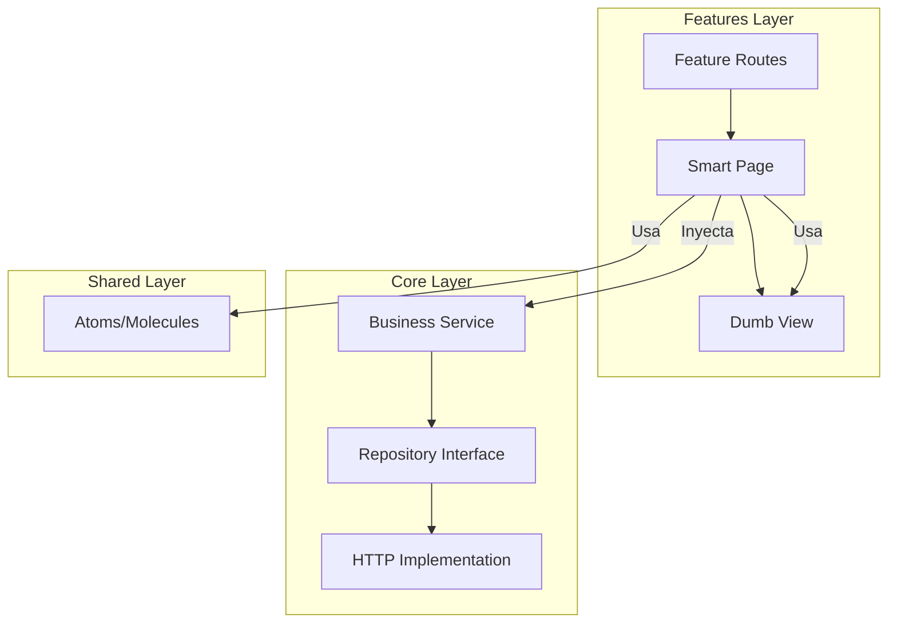

# Guía de Funcionamiento: Features y Módulos

Esta guía explica la arquitectura de los **Features** (Módulos de Negocio) en UrbanControl. Nuestra arquitectura separa la **Lógica de Negocio** de la **Interfaz de Usuario**, facilitando el mantenimiento y la escalabilidad.

---

## 1. ¿Qué es un Feature?
Un **Feature** (o Característica) es un módulo que agrupa una funcionalidad específica del negocio. 

- **Son "Inteligentes":** Conocen el contexto del negocio (ej: saben qué es un "Lote" o un "Cliente").
- **Manejan Rutas:** Cada feature define sus propios puntos de entrada (URLs).
- **Consumen Servicios:** Se comunican con la capa `core/` para obtener y enviar datos.

Se ubican en: `src/app/features/`

---

## 2. Estructura Interna de un Feature

Cada carpeta de feature tiene una organización estricta:

### 📂 `pages/` (Smart Components)
Son los componentes que "mandan". Están vinculados directamente a una ruta.
- **Función:** Inyectar servicios del `core/`, suscribirse a datos y manejar la lógica de la pantalla.
- **Ejemplo:** `list-lotes.page.ts` (Se encarga de pedir la lista de lotes al servicio y pasarla a la tabla).

### 📂 `views/` (Dumb Components / UI Local)
Son componentes visuales que **solo se usan dentro de este feature**.
- **Función:** Presentar datos recibidos por `@Input` y avisar acciones por `@Output`.
- **Regla:** No deben inyectar servicios ni conocer la lógica de la API.
- **Ejemplo:** `lote-card.component.ts` (Solo dibuja un cuadro con la info del lote).

### 📄 `<feature>.routes.ts`
Define cómo se accede a las páginas del módulo.
- Se integra en el sistema global mediante **Lazy Loading** (Carga perezosa), lo que significa que el código solo se descarga cuando el usuario entra a esa sección.

---

## 3. Flujo de Trabajo (¿Cómo funciona todo junto?)

Cuando un usuario interactúa con un Feature, ocurre lo siguiente:

1.  **Ruta:** El usuario navega a `/gestion-inmobiliaria/lotes`.
2.  **Page (Smart):** El componente en `pages/` se activa. En su `ngOnInit()`, llama al `LoteService` del `core/`.
3.  **Core (Service):** El servicio pide los datos al `Repository`.
4.  **UI (Shared/Views):** Una vez que llegan los datos, la **Page** los pasa a los componentes de **Shared** (como una tabla) o a sus **Views** locales para mostrarlos.



---

## 4. ¿Cuándo crear un Feature vs Shared?

| ¿Dónde lo pongo? | Razón |
| :--- | :--- |
| **`shared/components`** | Si el componente es genérico y se puede usar en **cualquier** parte de la app (ej: un botón, un buscador, un modal de carga). |
| **`features/<modulo>/views`** | Si el componente es específico de ese negocio y **no** se usará en otros módulos (ej: el visor de mapa de lotes). |

---

## 5. Generación Automática
Para crear un nuevo módulo con esta estructura, utiliza los scripts incluidos en la raíz del proyecto:

```powershell
# Ejemplo para crear el módulo de "ventas" con la entidad "factura"
.\create-architecture.bat ventas factura
```

Esto asegura que se creen todos los archivos siguiendo las reglas de la arquitectura automáticamente.
